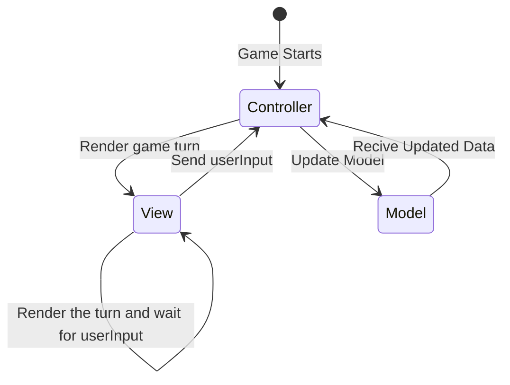

Per tornare alla [home](index.md)

# Architettura

## Pattern architetturale

L’architettura adottata per il progetto **Maze Escape** si basa sul pattern Model-View-Controller (MVC), scelta per la 
capacità di separare la logica di business, la presentazione all’utente, la gestione delle interazioni e la modellazione
del dominio del sistema. Questo pattern rientra tra i principi architetturali che definiscono i sottosistemi principali,
i loro confini, contratti e ruoli.

---

### Model

Il Model rappresenta i fondamenti della logica di gioco, includendo le regole, le entità in gioco, dunque sia l'utente
sia i guardiani, la mappa di gioco e gli enigmi necessari per il funzionamento del sistema. Lo sviluppo si concentra
sugli aspetti e sui costrutti di più alto livello del linguaggio scelto, orientandosi dunque su una programmazione
funzionale.

---

### View

Questa entità si assume la responsabilità di mostrare all'utilizzatore del sistema la mappa di gioco, la posizione
dell'utente e quella dei guardiani all'interno di quest'ultima. L'interfaccia sarà implementata in modo tale da fornire
al giocatore un'interfaccia chiara ma minimale, non essendo un aspetto centrale del processo di sviluppo. Nello
specifico verrà visualizzata una griglia costituita da un insieme celle, a ognuna delle quali sarà associato un simbolo
che permetta di identificare la tipologia di cella, e dovrà essere in grado di ricevere gli input dell'utente.

---

### Controller

Il Controller ha il compito di gestire l’interazione dell’utente con l'interfaccia grafica, interpretando in modo
corretto gli input che vengono generati e invocare i relativi metodi nel Model. È un punto cardine per la gestione del
ciclo di gioco, orchestrando in modo iterativo le azioni del giocatore durante l'esecuzione del sistema. Esso
rappresenta il punto di connessione tra le altre due entità già presentate.

---

## Motivazioni della scelta

L’adozione del pattern MVC e dei principi di programmazione funzionale offre diversi vantaggi chiave:
- **Separazione delle responsabilità**: i diversi aspetti del sistema (logica di business, presentazione, interazione)
sono distinti e gestiti da componenti dedicati, garantendo il rispetto del principio di Separation of Concerns (SOC).
- **Estensibilità e flessibilità**: il design modulare consente di aggiungere facilmente nuove componentistiche, quali
nuove tipologie di entità, nuove categorie di enigmi ed estendere l'interfaccia grafica, senza alterare la struttura di
base.
- **Manutenibilità:** La chiara divisione e l’uso di principi di immutabilità riducono gli effetti collaterali, rendendo
il codice più prevedibile e facile da modificare o correggere in futuro.
- **Testabilità:** Ogni componente può essere testato in isolamento, facilitando l’identificazione e la correzione di
eventuali problemi. Il progetto include test automatizzati per i moduli appartenenti al Model e al Controller.