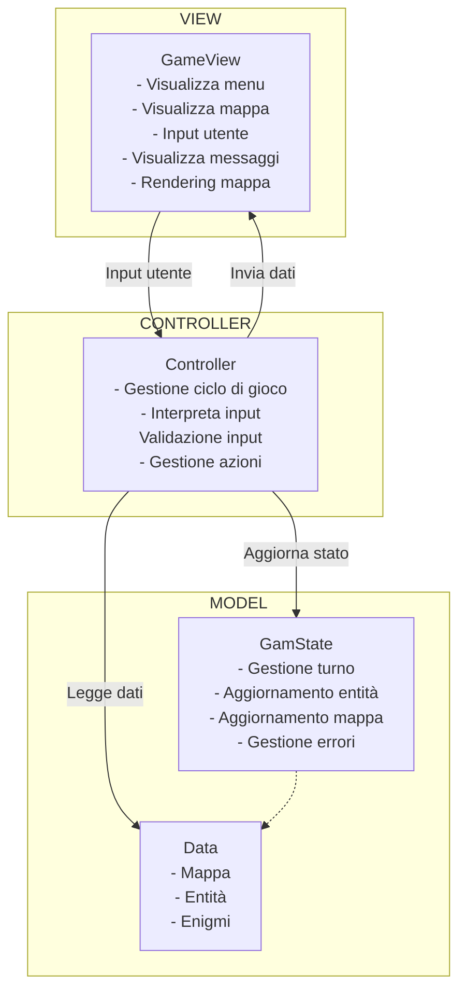

Per tornare alla [home](index.md)

# Design di dettaglio

L'architettura del sistema è progettata per garantire una chiara separazione delle responsabilità tra i diversi 
componenti. La struttura modulare permette di mantenere distinti la gestione dei dati e della logica di gioco,
l'interfaccia utente e il coordinamento delle operazioni. Questa organizzazione favorisce la manutenibilità del codice,
facilita eventuali modifiche e assicura un flusso ordinato delle informazioni attraverso i vari livelli del sistema,
dalla raccolta dell'input utente fino all'aggiornamento dello stato di gioco e alla sua visualizzazione.

Nel diagramma seguente è possibile vedere come i vari componenti del sistema interagiscono fra di loro ad alto livello.

---

## Design del Model

Il **Model** rappresenta il cuore logico del gioco, articolato in più moduli che riflettono gli aspetti fondamentali del
dominio: entità, mappa, enigmi, strategia, inventario, oggetti e stato del gioco. Ciascun componente è modellato come un
modulo indipendente ma interconnesso, con interfacce ben definite per promuovere modularità e coerenza.

* **Player e Guardian:** rappresentano le due tipologie di entità, con ruoli e comportamenti diversificati. Entrambi
interagiscono con lo stato globale tramite azioni specifiche, che a loro volta influenzano la mappa. Queste entità
condividono il comportamento definito nel trait **Entity**.
* **Maze:** modella la mappa di gioco costituito da celle calpestabili, mura invalicabili e porte, calpestabili solo se
preventivamente aperte.
* **Puzzle e PuzzleRepository:** rappresentano rispettivamente la struttura degli enigmi e le diverse implementazioni
e il bacino di enigmi da esporre al giocatore.
* **GuardianStrategy:** definisce un comportamento mediamente complesso relativo al movimento del guardiano con 
l'obiettivo di identificare il percorso più breve per raggiungere il giocatore.
* **Item e Inventory:** rappresentano rispettivamente la struttura degli oggetti e le diverse implementazioni e
l'inventario, considerato come contenitore di oggetti, associato al giocatore.
* **Position:** modellazione personalizzata della posizione.
* **Game:** il punto cardine dell’intero stato di gioco. Mette in relazione la mappa, le entità (giocatore e guardiani),
il livello di difficoltà e il turno corrente, coordinando l’evoluzione dello stato durante la partita.

---

## Design del Controller

Il **Controller** agisce da coordinatore centrale, gestendo il flusso di gioco e orchestrando le interazioni tra **Model**
e **View**. Si assume la responsabilità di interpretare correttamente l'input dell'utente. In particolare ogni azione
dell’utente viene catturata e tradotta in modifiche allo stato, attraverso una catena di trasformazioni ben definite.

---

## Design della View

La **View** si occupa di mostrare la mappa di gioco, intercettare l'input dell'utente e mostrare le informazioni di
gioco. Il suo design è stato pensato per essere disaccoppiato dalla logica di gioco mentre predispone i metodi necessari
che possano essere utilizzati dal controller per la renderizzazione dello stato di gioco.