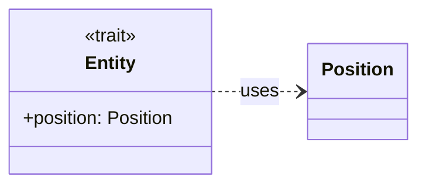
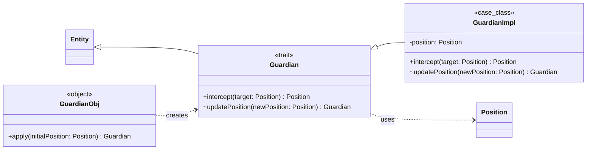
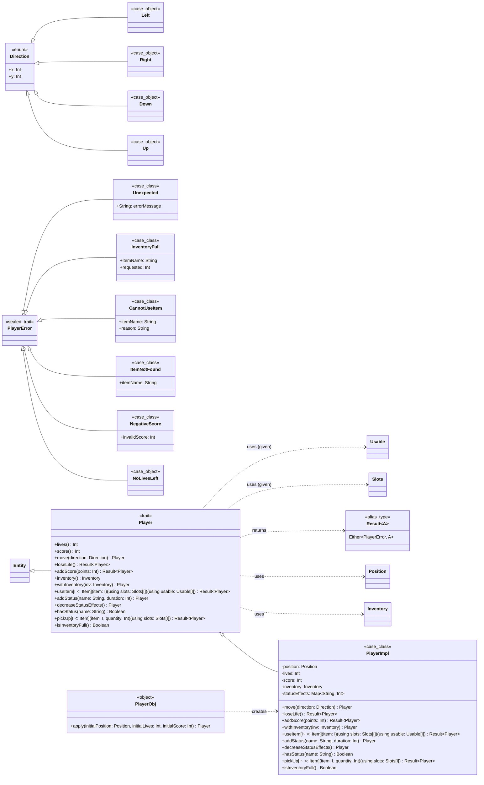
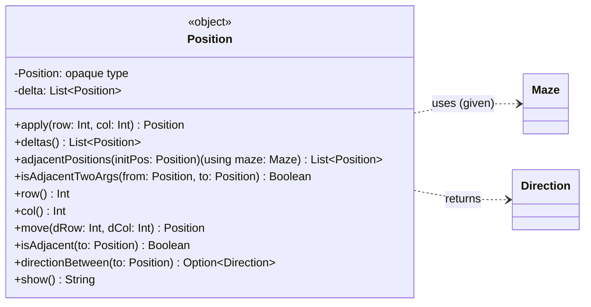
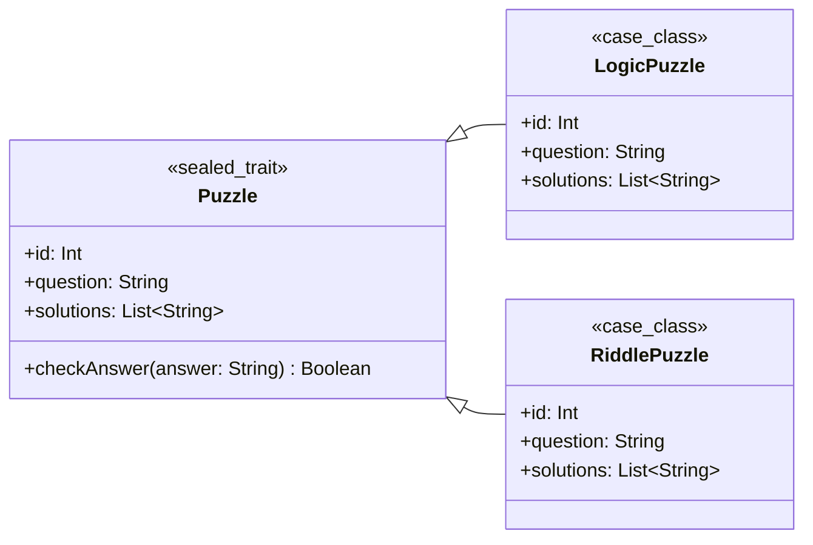
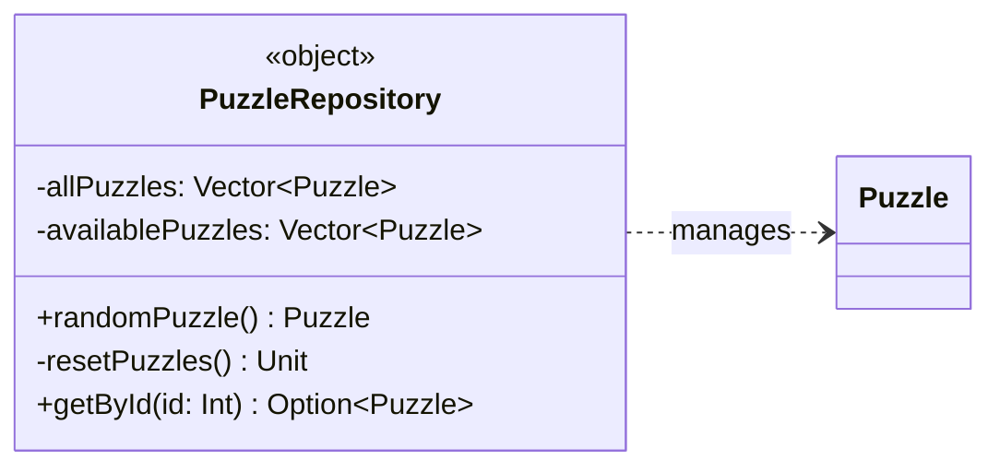
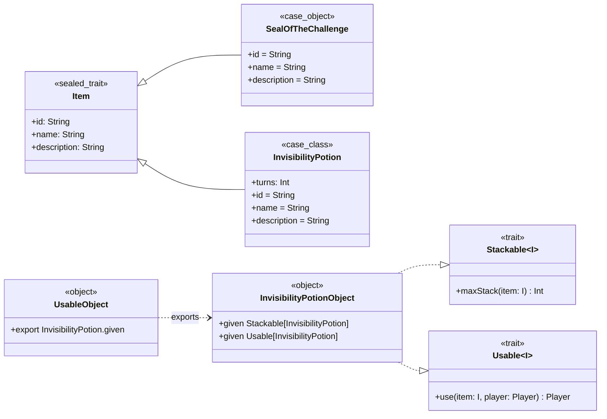
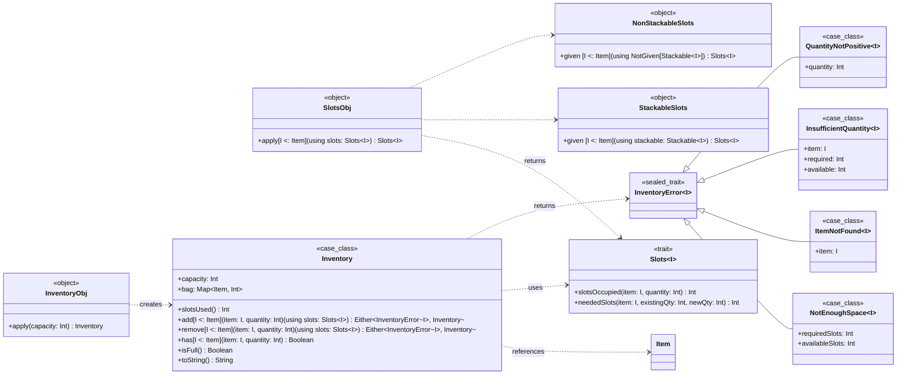
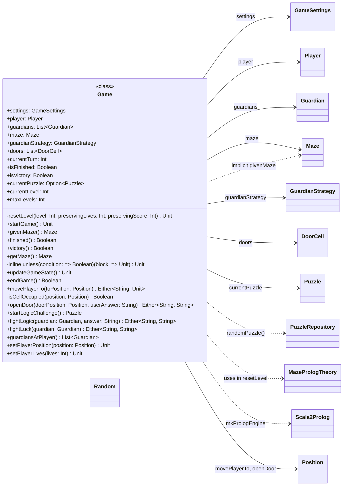

# Introduzione

Durante l’implementazione del progetto denominato **Maze Escape** mi sono occupato della progettazione e dello sviluppo
di componenti chiave lato modello e in pair-programming di moduli legati al controller e alla definizione e 
implementazione del comportamento del guardiano in Prolog, ponendo la massima attenzione ai requisiti definiti
garantendo coerenza del sistema. Di seguito sono definiti i moduli da me interamente implementati.

# Model

## Entity

**Descrizione:**

`Entity` è un trait che modella qualsiasi entità presente all'interno del sistema, facente parte del package 
`model.entities`. Ogni entità è caratterizzata da una posizione in modo che possa essere identificata nella mappa di 
gioco. Se in futuro dovessero essere identificate nuove proprietà comuni a tutte le entità, si potrebbe ad esempio
assegnare un nome a ognuna, sarà semplicemente necessario aggiungerle all'interfaccia.

**Diagramma Mermaid della classe**

## Guardian

**Descrizione:**

`Guardian` modella il guardiano controllato dal sistema. In particolare gestisce il movimento del guardiano. Implementa
il pattern **trait con case class immutabile** per separare l'interfaccia dalla sua implementazione, favorendo 
estensibilità e testabilità. Utilizza inoltre il pattern **companion object** per la costruzione di nuove istanze.
Estende il trait `Entity` e appartiene al package `model.entities`.

**Caratteristiche funzionali:**

* **Immutabilità:** tutti gli stati sono gestiti tramite case class immutabili (`GuardianImpl`), permettendo uno stato
prevedibile e thread-safe, ossia nessun dato condiviso può essere corrotto da scritture concorrenti. I parametri presenti
sono tutti `val` quindi una volta creata un’istanza, non è possibile modificarne i campi. Ogni modifica genera infatti
un nuovo oggetto.
* **Purezza delle funzioni:** le azioni restituiscono nuovi stati senza effetti collaterali, favorendo semplicità di
ragionamento e testabilità.
* **Utilizzo di alias type:** il tipo di ritorno `Position` migliora la chiarezza e la manutenibilità del codice.
* **Utilizzo di pattern matching:** per computare il calcolo della nuova eventuale posizione del guardiano.
* **Vantaggi:**
  * Stato sempre aggiornato e coerente, grazie all’immutabilità.
  * Separazione netta tra interfaccia e implementazione.
  * Estensibilità per future meccaniche di gioco che coinvolgano il guardiano.

**Diagramma mermaid della classe:**

## Player

**Descrizione:**

`Player` rappresenta il giocatore controllato dall'utente e mette a disposizione un set di azioni eseguibili dall'utente
sia legati allo status del giocatore che del suo inventario. Implementa il pattern **trait con case class immutabile**
per separare l'interfaccia dalla sua implementazione, favorendo estensibilità e testabilità. Utilizza il pattern
**companion object** per la costruzione di nuove istanze. Estende il trait `Entity` e appartiene al package
`model.entities`.

**Caratteristiche funzionali:**

* **Immutabilità:** tutti gli stati sono gestiti tramite case class immutabili (`PlayerImpl`), permettendo uno stato
prevedibile e thread-safe, ossia nessun dato condiviso può essere corrotto da scritture concorrenti. I parametri presenti
sono tutti `val` quindi una volta creata un’istanza, non è possibile modificarne i campi. Ogni modifica genera infatti
un nuovo oggetto.
* **Purezza delle funzioni:** le azioni restituiscono nuovi stati senza effetti collaterali, favorendo semplicità di
ragionamento e testabilità.
* **Utilizzo di sealed trait:** limita le estensioni delle sottoclassi nello stesso file, migliorando sicurezza ed
**exhaustive checking** nel pattern matching.
* **Utilizzo di pattern matching:** per decomporre e analizzare i dati strutturati garantendo leggibilità e chiarezza,
con riduzione del boilerplate.
* **Utilizzo di alias type:** i tipi di ritorno `Result` e `Position` (tipo importato) migliorano la chiarezza e la 
manutenibilità del codice.
* **Utilizzo di Algebraic Data Type (ADT):** sia nella definizione della direzione `Direction` che nella definizione
degli errori personalizzati `PlayerError` legati ai metodi del modulo. Questi garantiscono sicurezza di tipo ed
esaustività, verificando che ogni possibile variante del tipo sia considerata in sede di compilazione, garantendo 
chiarezza, manutenibilità, composizione e riutilizzo.
* **Utilizzo di upper bound:** nella definizione di alcuni metodi quali `pickUp` per garantire maggiore sicurezza a
compile-time e flessibilità delle API.
* **Utilizzo di impliciti e given:** definiscono i parametri di contesto, rendendo il codice più flessibile e pulito
senza la necessità di fornire esplicitamente i parametri.
* **Combinatori funzionali per trasformazioni:** uso di combinatori come `filter` e `map` per rendere il codice
maggiormente leggibile e comprensibile.
* **Vantaggi:**
  * Stato sempre aggiornato e coerente, grazie all’immutabilità.
  * Centralizzazione delle direzioni, favorendo riuso e coerenza nei metodi che calcolano la posizione dell'utente.
  * Separazione netta tra interfaccia e implementazione.
  * Estensibilità per future meccaniche di gioco che coinvolgano il giocatore.
  * Estensibilità sia per gli errori lato utente sia per le direzioni del movimento.

**Diagramma mermaid della classe:**

## Position

**Descrizione:**

`Position` rappresenta la posizione di una generica entità. Le coordinate spaziali sono modellate tramite un `opaque
type` implementato da una coppia di interi per rappresentare la mappa di gioco in 2D. Appartiene al package 
`model.utils`.

**Caratteristiche funzionali:**

* **Purezza delle funzioni:** le azioni restituiscono nuovi stati senza effetti collaterali, favorendo semplicità di
ragionamento e testabilità.
* **Utilizzo di pattern matching:** per decomporre e analizzare i dati strutturati garantendo leggibilità e chiarezza,
con riduzione del boilerplate.
* **Utilizzo di opaque type:** tipo opaco utilizzato come alias per incapsulare all'interno dell'object `Position`
l'implementazione della posizione garantendo che ogni operazione passi dalle factory e dalle extension. Questo migliora
la sicurezza di tipo e riduce i rischi di manipolazioni non controllate. Viene infatti dichiarato un nuovo tipo `Position`
che, fuori dall’oggetto, è distinto dalla tupla (Int, Int). L'utilizzo delle extension migliora inoltre la leggibilità.
* **Utilizzo di impliciti e given:** definiscono i parametri di contesto, rendendo il codice più flessibile e pulito
senza la necessità di fornire esplicitamente i parametri.
* **Combinatori funzionali per trasformazioni:** uso di combinatori come `filter` e `map` per rendere il codice
maggiormente leggibile e comprensibile.
* **Vantaggi:**
    * Stato sempre aggiornato e coerente, grazie all’immutabilità.
    * Centralizzazione delle posizioni adiacenti, favorendo riuso e coerenza nei metodi che calcolano posizioni adiacenti.
    * Nessun overhead a runtime, il tipo opaco è basato su una semplice tupla (Int, Int) senza wrapper aggiuntivi.
    * Estensibilità per future meccaniche di gioco che coinvolgano la posizione.

**Diagramma mermaid della classe:**

## Puzzle

**Descrizione:**

`Puzzle` rappresenta un generico enigma che l'utente deve risolvere sia per sconfiggere un guardiano nel caso in cui la
sfida sia di tipo logico che per aprire una porta. Implementa il pattern **trait con case class** per separare
l'interfaccia dalla sua implementazione, favorendo estensibilità e testabilità. Appartiene al package `model.puzzle`.

**Caratteristiche funzionali:**

* **Immutabilità:** tutti gli stati sono gestiti tramite case class immutabili (`LogicPuzzle` e `RiddlePuzzle`),
permettendo uno stato prevedibile e thread-safe, ossia nessun dato condiviso può essere corrotto da scritture concorrenti.
I parametri presenti sono tutti `val` quindi una volta creata un’istanza, non è possibile modificarne i campi. Ogni
modifica genera infatti un nuovo oggetto.
* **Utilizzo di sealed trait:** limita le estensioni delle sottoclassi nello stesso file, migliorando sicurezza ed 
**exhaustive checking** nel pattern matching.
* **Implementazione principio DRY:** il metodo `checkAnswer` fornisce una logica comune per tutte le sottoclassi senza
duplicazione di codice.
* **Combinatori funzionali per trasformazioni:** uso di combinatori come `map` per rendere il codice maggiormente
leggibile e comprensibile.
* **Vantaggi:**
  * Separazione netta tra interfaccia e implementazione.
  * Estensibilità per future meccaniche di gioco che coinvolgano gli enigmi.

**Diagramma mermaid della classe:**

## PuzzleRepository

**Descrizione:**

`PuzzleRepository` rappresenta il contenitore di enigmi e mette a disposizione un insieme di metodi per interagire con
questo contenitore, quali la selezione casuale di un puzzle o il recupero tramite codice identificativo. Archivia la
collezione completa in una struttura immutabile, ma mantiene uno stato temporaneo in una variabile per evitare
ripetizioni nella selezione casuale. Appartiene al package `model.puzzle`.

**Caratteristiche funzionali:**

* **Combinatori funzionali per trasformazioni:** uso di combinatori come `filterNot` e `find` per rendere il codice
maggiormente leggibile e comprensibile.
* **Vantaggi:**
  * Separazione tra la logica di definizione e creazione degli enigmi e il contenitore che gestisce le diverse tipologie.

**Diagramma mermaid della classe:**

## GameSettings

**Descrizione:**

`GameSettings` centralizza la configurazione generale del gioco, incapsulando le impostazioni legate alla difficoltà,
alla modalità di gioco e ai parametri statistici per il giocatore. Viene utilizzato un pattern modulare per offrire
configurazioni flessibili e riutilizzabili. Utilizza il pattern **companion object** per la costruzione di nuove istanze
le quali possono essere sia personalizzate o ricavabili in base al livello di difficoltà. Appartiene al package
`model.utils`.

**Caratteristiche funzionali:**

* **Utilizzo di pattern matching:** per decomporre e analizzare i dati strutturati garantendo leggibilità e chiarezza,
con riduzione del boilerplate.
* **Modularità e riusabilità:** le configurazioni sono mappate in base al livello di difficoltà con delle mappe,
semplificando modifiche future o l’aggiunta di nuovi livelli.
* **Vantaggi:**
  * Centralizzazione delle impostazioni di gioco, favorendo riuso e coerenza nei metodi che si basano su tale classe.
  * Estensibilità per future meccaniche di gioco che coinvolgano le impostazioni di gioco.

## Item

**Descrizione:**

La gerarchia di `Item` definisce il concetto di oggetto di gioco, differenziando le caratteristiche comuni, quali
possono essere identificativo, nome e descrizione, dalle caratteristiche univoche quali la possibilità di essere
impilabili e di essere utilizzati da un giocatore. Implementa il pattern **trait con case class** per separare
l'interfaccia dalla sua implementazione, favorendo estensibilità e testabilità. Utilizza il pattern **companion object**
per associare a ogni item caratteristiche speciali definendo il corretto given. Utilizza il pattern **export/import**
in modo che il cliente non debba conoscere la struttura interna. Appartiene al package `model.utils`.

**Caratteristiche funzionali:**

* **Immutabilità:** tutti gli stati sono gestiti tramite case class/object immutabili, permettendo uno stato
prevedibile e thread-safe, ossia nessun dato condiviso può essere corrotto da scritture concorrenti. I parametri presenti
sono tutti `val` quindi una volta creata un’istanza, non è possibile modificarne i campi. Ogni modifica genera infatti
un nuovo oggetto.
* **Purezza delle funzioni:** le azioni, come `use`, restituiscono nuovi stati senza effetti collaterali, favorendo
semplicità di ragionamento e testabilità.
* **Utilizzo di sealed trait:** limita le estensioni delle sottoclassi nello stesso file, migliorando sicurezza ed
**exhaustive checking** nel pattern matching.
* **Utilizzo di Algebraic Data Type (ADT):** garantiscono sicurezza di tipo ed esaustività, verificando che ogni
possibile variante del tipo sia considerata in sede di compilazione, garantendo chiarezza, manutenibilità, composizione
e riutilizzo.
* **Utilizzo di impliciti e given:** definiscono i parametri di contesto, rendendo il codice più flessibile e pulito
senza la necessità di fornire esplicitamente i parametri.
* **Utilizzo pattern export/import:** garantisce incapsulamento della struttura interna, un punto unico di accesso,
riduzione del boilerplate e maggiore coerenza e manutenzione.
* **Vantaggi:**
  * Stato sempre aggiornato e coerente, grazie all’immutabilità.
  * Centralizzazione della definizione degli item e delle loro caratteristiche, favorendo riuso e coerenza.
  * Separazione netta tra interfaccia e implementazione.
  * Estensibilità per future meccaniche di gioco che coinvolgano gli item.

**Diagramma mermaid della classe:**

## Inventory

**Descrizione:**

`Inventory` modella un inventario immutabile tramite l'uso di una coppia di valori `capacity` e `bag` dove il primo
rappresenta il numero massimo di `Slots[T]` disponibili, il secondo una mappa che associa a ogni `Item` la quantità
attualmente posseduta. Tutte le operazioni sono pure e restituiscono un nuovo oggetto anziché mutare lo stato esistente.
Il calcolo degli slot occupati sfrutta il pattern **type class** `Slots[T]` e le sue due istanze date: `StackableSlots`
e `NonStackableSlots`. Infatti attualmente sono presenti due macro-categorie di `Item`, quelli che si possono impilare
all'interno di uno stesso slot e quelli che non possono essere impilati, dunque ogni istanza occupa uno slot. Utilizza
il pattern **export/import** in modo che il cliente non debba conoscere la struttura interna. Infine utilizza il pattern
**companion object** per generare mappe vuote con la capacità voluta. Appartiene al package `model.utils`.

**Caratteristiche funzionali:**

* **Immutabilità:** tutti gli stati sono gestiti tramite case class immutabili, permettendo uno stato prevedibile e 
thread-safe, ossia nessun dato condiviso può essere corrotto da scritture concorrenti. I parametri presenti sono tutti
`val` quindi una volta creata un’istanza, non è possibile modificarne i campi. Ogni modifica genera infatti un nuovo 
oggetto.
* **Purezza delle funzioni:** le azioni restituiscono nuovi stati senza effetti collaterali, favorendo semplicità di
ragionamento e testabilità.
* **Utilizzo di sealed trait:** limita le estensioni delle sottoclassi nello stesso file, migliorando sicurezza ed
**exhaustive checking** nel pattern matching.
* **Utilizzo di pattern matching:** per decomporre e analizzare i dati strutturati garantendo leggibilità e chiarezza,
con riduzione del boilerplate.
* **Utilizzo type class:** il trait `Slots[T]` calcola gli slot occupati da un item in base alla quantità. In
particolare `StackableSlots` richiede la presenza di uno `Stackable[T]` e aggrega gli item per slot, mentre
`NonStackableSlots` viene utilizzato quando non è presente nessuna istanza precedente, tramite `NotGiven[Stackable[T]]`
e assegna uno slot a ogni item.
* **Utilizzo di Algebraic Data Type (ADT):** nella definizione degli errori personalizzati `InventoryError[T]` legati ai
metodi del modulo. Questi garantiscono sicurezza di tipo ed esaustività, verificando che ogni possibile variante del
tipo sia considerata in sede di compilazione, garantendo chiarezza, manutenibilità, composizione e riutilizzo.
* **Utilizzo di upper bound:** nella definizione di alcuni metodi quali, ad esempio, `add` e `remove` per garantire
maggiore sicurezza a compile-time e flessibilità delle API.
* **Utilizzo pattern export/import:** garantisce incapsulamento della struttura interna, un punto unico di accesso,
riduzione del boilerplate e maggiore coerenza e manutenzione.
* **Utilizzo di impliciti e given:** definiscono i parametri di contesto, rendendo il codice più flessibile e pulito
senza la necessità di fornire esplicitamente i parametri.
* **Combinatori funzionali per trasformazioni:** uso di combinatori come `map` per rendere il codice maggiormente
leggibile e comprensibile.
* **Vantaggi:**
  * Stato sempre aggiornato e coerente, grazie all’immutabilità.
  * Centralizzazione del calcolo degli slots e configurabile tramite type class, favorendo riuso e coerenza.
  * Estensibilità per future meccaniche di gioco che coinvolgano l'inventario.
  * Estensibilità sia per gli errori relativi all'inventario sia per l'integrazione di nuovi item, sarà necessario
    definirne uno nuovo e fornire o derivare la relativa istanza `Slots`.

**Diagramma mermaid della classe:**

## Game

**Descrizione:**

Il modulo `Game` gestisce il ciclo principale e lo stato della partita. Si appoggia a una strategia Prolog per il
movimento dei guardiani e attinge enigmi da un repository dedicato. Utilizza implicit `given` per fornire automaticamente
il labirinto alle API che lo richiedono senza passaggio esplicito. Utilizza il **pattern matching** per decomporre e
analizzare i dati strutturati garantendo leggibilità e chiarezza, con riduzione del boilerplate. Utilizzo di `inline`
per creare controlli personalizzati senza overhead di funzione a runtime e rendere il codice più intuitivo.

**Diagramma mermaid della classe:**

